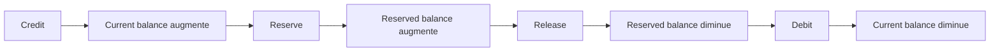

# NeoLedger 🚀

NeoLedger est un système de gestion de transactions financières distribué, construit avec **Java 21**, **Spring Boot 3.4
** et **Apache Kafka**.

## 🏗 Architecture du Projet

Le projet est découpé en modules Gradle pour assurer une séparation stricte des responsabilités :

* **`common`** : Contient les définitions Protobuf, les utilitaires partagés et la configuration globale des tests (
  Singleton Kafka).
* **`transaction`** : Microservice gérant la logique métier des transactions, les validations et l'ingestion de données
  via Kafka.

---

## 💳 Mouvement d'un compte

Le domaine `Account` manipule deux soldes:

* `current_balance` : solde total du compte
* `reserved_balance` : part du solde déjà bloquée

### Flux métier



### Exemple

Etat initial:

* `current_balance = 100`
* `reserved_balance = 30`
* `available = 70`

Operations:

1. `credit(20)` -> `current_balance = 120`
2. `reserve(50)` -> `reserved_balance = 80`
3. `release(20)` -> `reserved_balance = 60`
4. `debit(10)` -> `current_balance = 110`

Regle de reservation:

* une reservation est autorisee seulement si `amount <= current_balance - reserved_balance`
* sinon, l'operation est refusee

---

## 🛠 Pré-requis

Avant de commencer, assurez-vous d'avoir installé :

* **Java 21** (Amazon Corretto ou Temurin recommandés)
* **Docker** (Nécessaire pour les tests d'intégration avec Testcontainers)
* **Gradle 8.x** (ou utiliser le wrapper `./gradlew`)

---

## 🚀 Installation & Build

1. **Cloner le projet** :
   ```bash
   git clone [https://github.com/votre-username/neo-ledger.git](https://github.com/votre-username/neo-ledger.git)
   cd neo-ledger

```

2. **Compiler tous les modules** (génère aussi le code Protobuf) :
```bash
./gradlew build

```

3. **Générer uniquement le code Protobuf** :

```bash
./gradlew :common:generateProto

```

---

## 🧪 Tests d'intégration

Nous utilisons **Testcontainers** pour garantir que nos tests d'intégration tournent sur une instance réelle de Kafka.

### Configuration du Singleton Kafka

Pour optimiser les performances, un Singleton Kafka est défini dans `common/src/testFixtures`. Il permet de ne lancer
qu'une seule instance Docker pour toute la suite de tests.

**Lancer les tests** :

```bash
./gradlew test

```

> **Note** : Si vous êtes sur macOS avec une puce Apple Silicon (M1/M2/M3), assurez-vous que Docker Desktop ou OrbStack
> est lancé.

---

## 📦 Stack Technique

| Technologie         | Usage                                  |
|---------------------|----------------------------------------|
| **Spring Boot 3.4** | Framework applicatif                   |
| **Kafka**           | Bus de messages                        |
| **Protobuf**        | Sérialisation des données              |
| **Testcontainers**  | Environnement de test jetable (Docker) |
| **JUnit 5**         | Framework de test                      |
| **Guava**           | Bibliothèques utilitaires Google       |

---

## 📝 À propos de NeoLedger

Ce projet vise à fournir une solution de ledger (grand livre) immuable et performante en utilisant les meilleures
pratiques de développement Java moderne.
